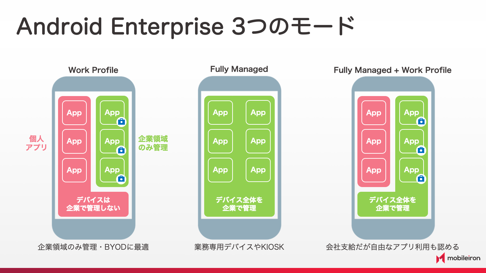
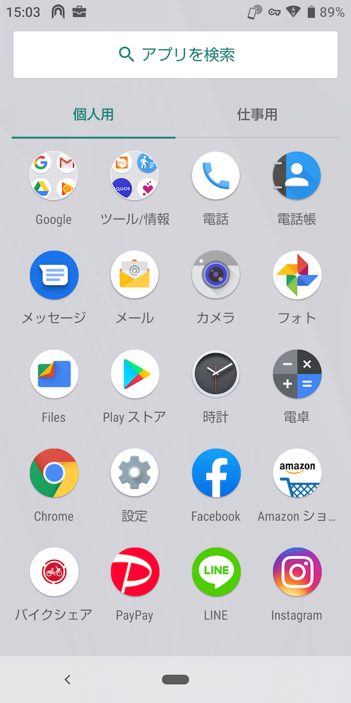
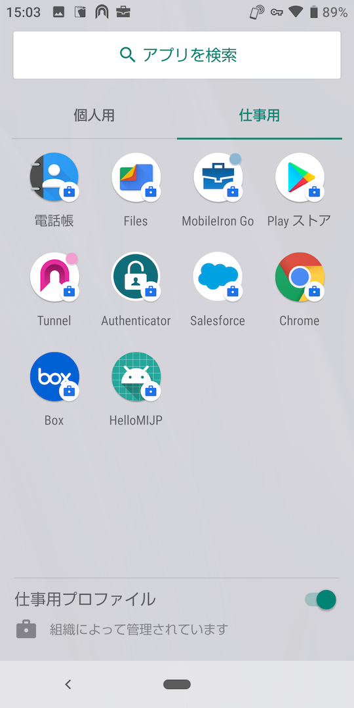

# Android Enterpriseの管理モード

Android Enterpriseは、次の３つの管理モードのいずれかで利用することができます。

- Work Profile
- Fully Managed
- Fully Managed + Work Profile

以下のスクリーンショットはWork Profileが構成されたデバイスの例です。
個人のGoogleアカウントを設定して利用しているAndroidデバイスを、MobileIron Cloudに登録することにより、企業の領域であるWork Profileが構成されます。Playストアが個人用と仕事用の領域それぞれに表示されています。仕事用のPlayストアからはIT管理者が指定したパブリックアプリまたはインハウス開発アプリのみがダウンロードでき、インストールされた仕事のアプリは鞄のマークのバッジ付きアイコンで表示されます。※Androidバージョンや機種によってレイアウトは異なります。

