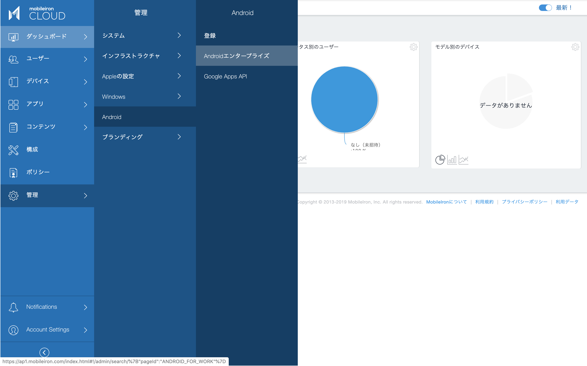
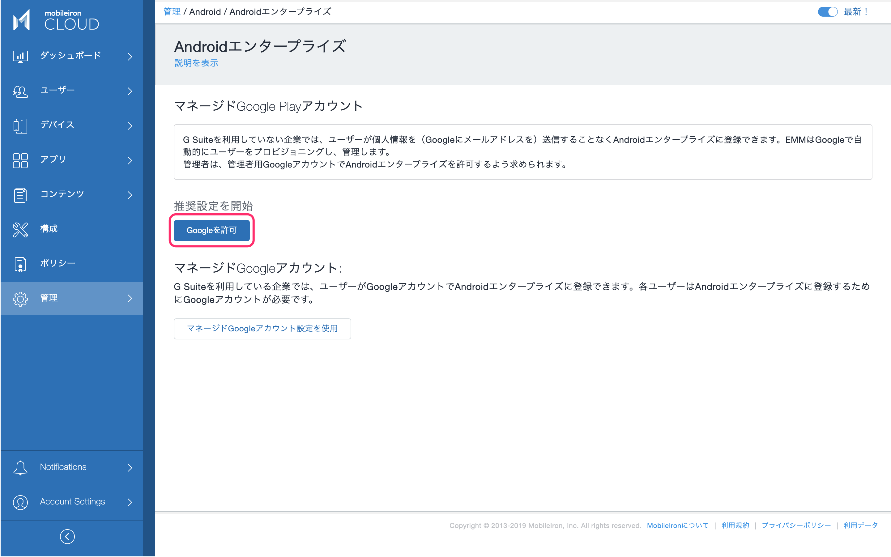
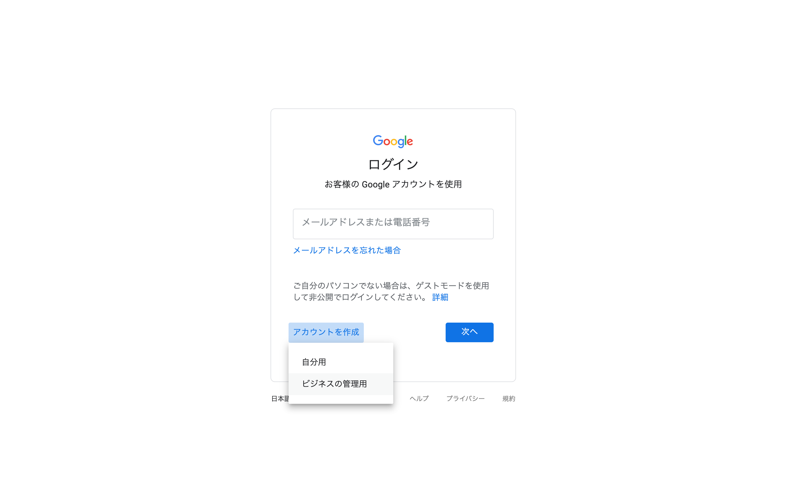
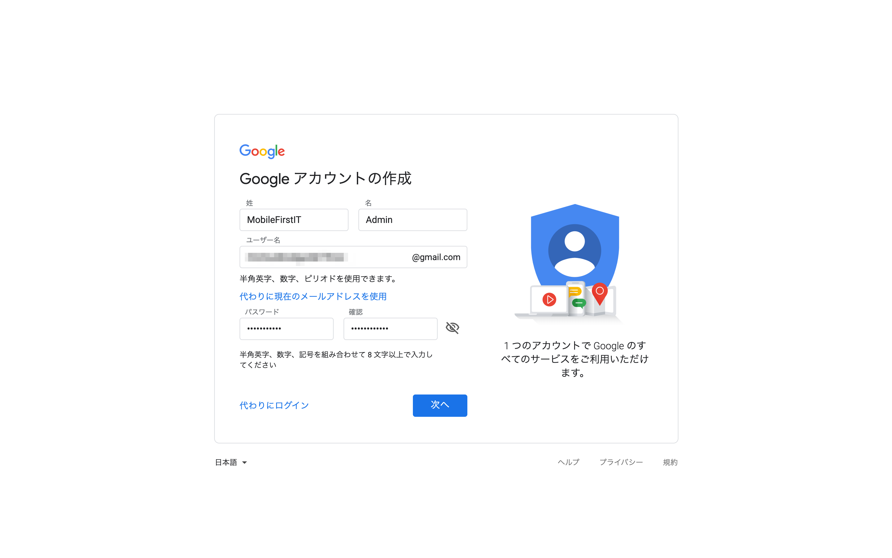
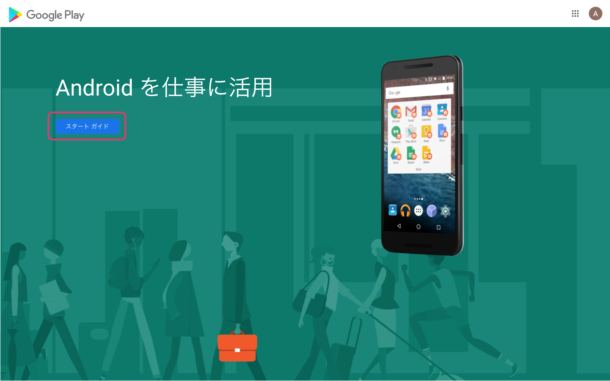
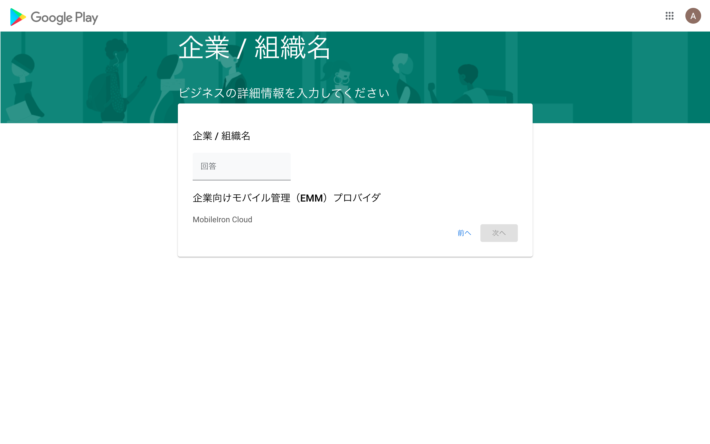
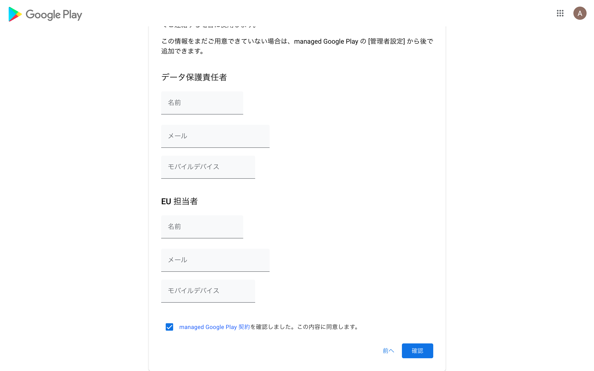
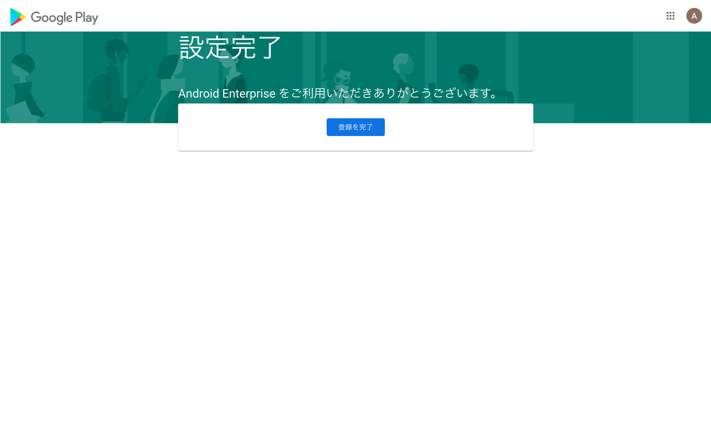
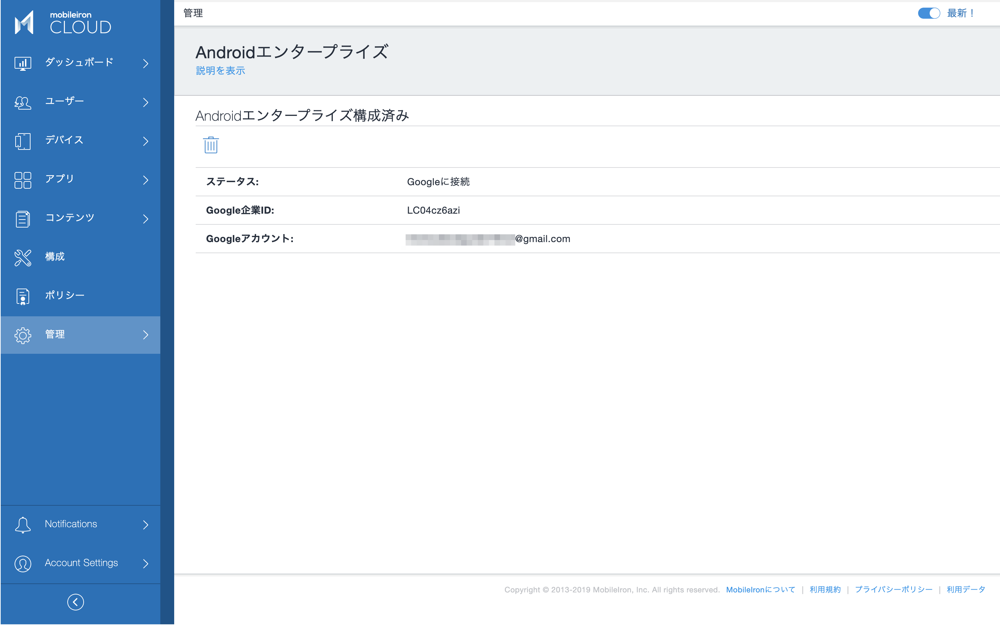

# Android Enterpriseを有効にする

Androidデバイスは、Googleが定めるAndroid Enterpriseのしくみに従って管理します。Android Enterpriseを利用するために、組織のGoogle Play（Managed Google Play）アカウントを作成し、MobileIron Cloudと接続する必要があります。

この先の設定に進む前に、作業に利用するWebブラウザではすべてのGoogleアカウントからログアウトしておくことをお勧めします。

管理 > Android > Androidエンタープライズ

推奨設定に従って Googleを許可 ボタンをクリックします。

Googleのサイトが開きますのでログインボタンをクリックします。

ここでは新しく組織のGoogleアカウントを作成していきます。すでに組織のGoogleアカウントを作成済みの場合はそちらでログインして下さい。

@gmail.comのアカウントで問題ありません。

作成した組織のアカウントでサインインしました。「スタートガイド」へ進みます。

MobileIron CloudがEMMプロバイダとして認識されています。企業/組織名を入力し次へ進みます。

Managed Google Play 契約に同意し、「確認」ボタンをクリックします。組織にデータ保護責任者、EU担当者を置いている場合は入力して下さい。

「登録を完了」ボタンをクリックするとMobileIron Cloudの画面に戻ります。

Googleとの接続が保存されました。

