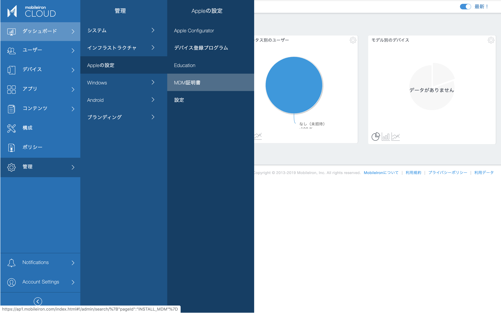
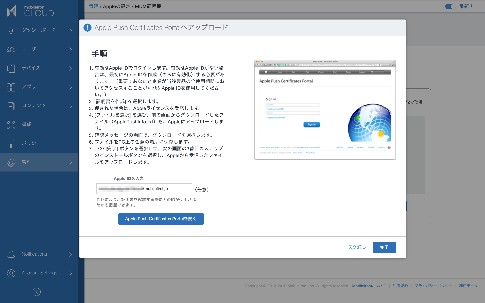
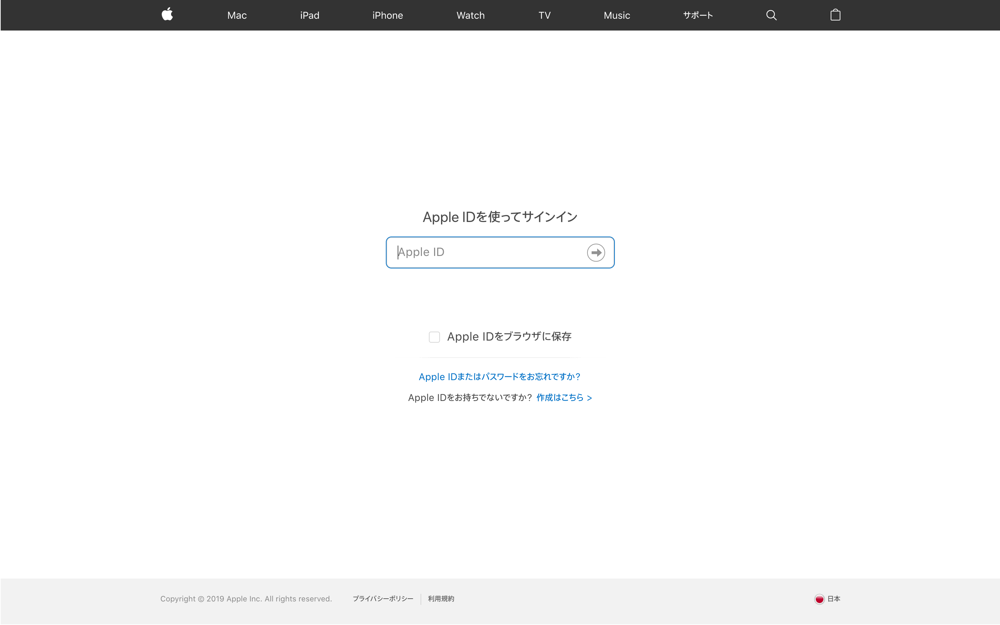
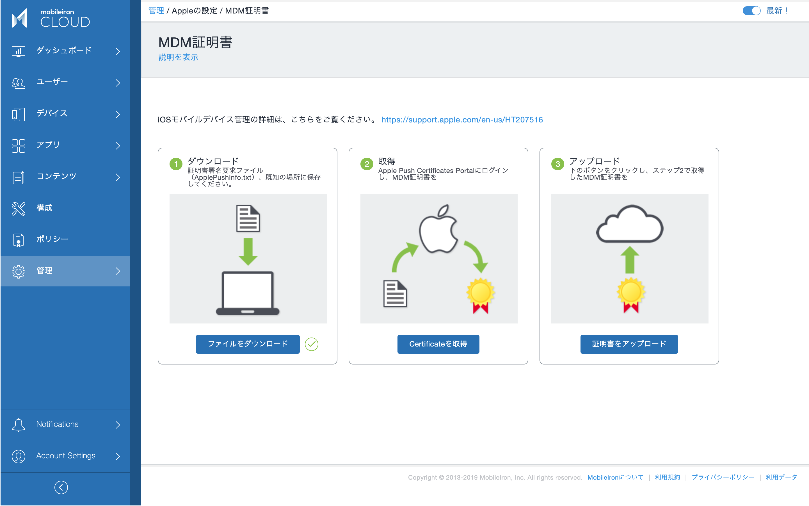
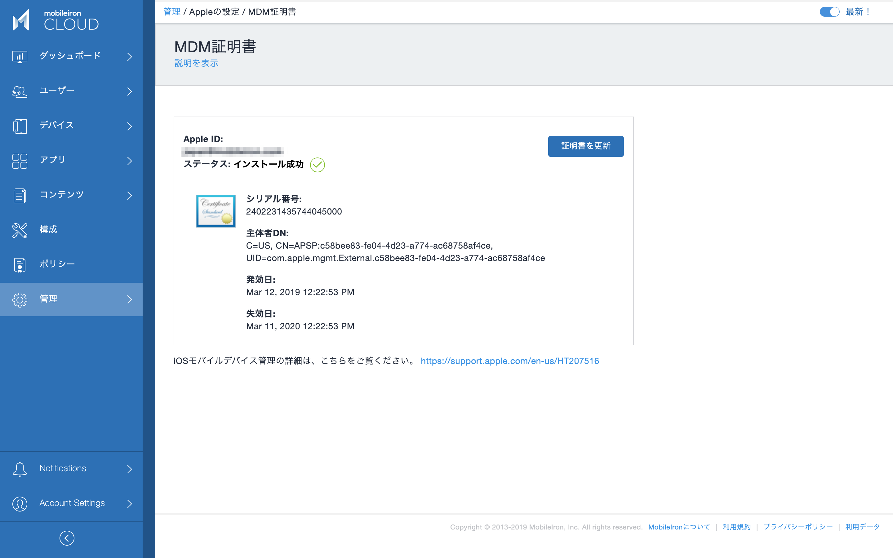

# Apple MDMを有効にする

iOS (iPadOS) /macOS デバイスの管理は、Appleが定めるApple MDMのしくみに従って行います。Apple MDMでは、MobileIron CloudからiOSデバイスを呼び出すためにAPNS（Apple Push Notification Service）を利用しますが、MobileIron CloudがAPNSへ接続するために、Appleから発行されたMDM証明書をインストールする必要があります。MDM証明書はAppleから無償で発行されます。また1年毎に更新する必要があります。

MDM証明書の発行を受けるためにApple IDが必要ですので https://appleid.apple.com/ で予め作成して下さい。Apple IDの準備ができたら次の作業に進みます。

このときApple IDとなるメールアドレスには、グループアドレス（エイリアス）の利用を強く推奨します。MDM証明書は毎年同じApple IDによって更新する必要があり、MobileIron Cloud管理者の異動や退職によって同じApple IDが使えない状況に陥ることを防ぐためです。MDM証明書の更新時に同じApple IDが利用できない場合、MobileIron Cloudに登録されている全てのiOSデバイスのコントロールを失い、再登録が必要になります。またデバイスに保存されたデータも失う可能性があります。

管理 > Appleの設定 > MDM証明書

最初に「ファイルをダウンロード」をクリックします。MobileIron CloudがAppleの認証局へのMDM証明書発行要求を生成し、手元のPCにダウンロードされます。

ファイルをローカルPCに保存したら、「Certificateを取得」をクリックします。

これからApple Push Certificates Portalを開き、MDM証明書の発行をリクエストしますが、利用するApple IDを次の画面で入力しておきます。この項目は任意ですが、1年後にMDM証明書をどのApple IDで行えば良いかを確実に残しておく必要があるため、とても重要です。

「Apple Push Certificates Portalを開く」ボタンをクリックします。

準備しておいた組織のApple IDでサインインします。

Apple Push Certificates Portalにサインインできました。Create Certificate ボタンをクリックします。

Terms of Useに同意します。

MobileIron CloudからダウンロードしたMDM証明書発行要求のファイルをアップロードします。またNotesにはどのMDMサーバのためのMDM証明書かが分かるようなメモを入れておくと良いでしょう。

証明書が発行されたら、Downloadボタンをクリックし、ファイルをローカルPCに保存します。

MobileIron Cloudの管理コンソールに戻り、「証明書をアップロード」ボタンをクリックします。

Apple Push Certificates Portalからダウンロードした証明書ファイルを選択しアップロードすれば完了です。

Apple Push Certificates Portalに行く前にApple IDを入力しておいた場合、この画面に残ります。

