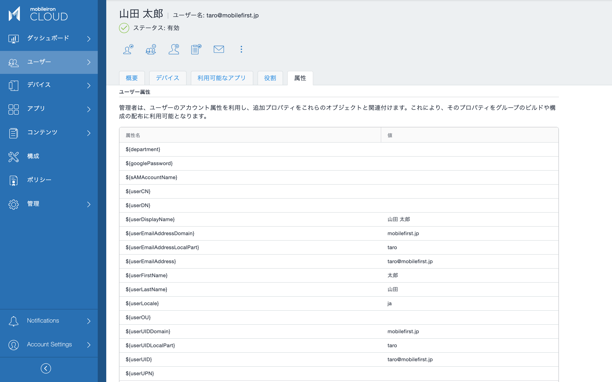
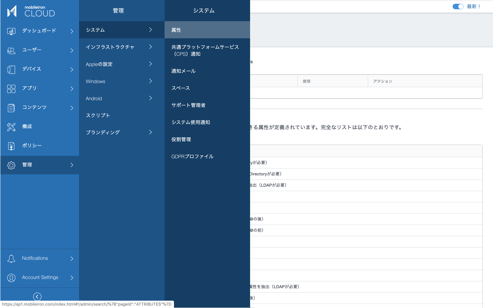
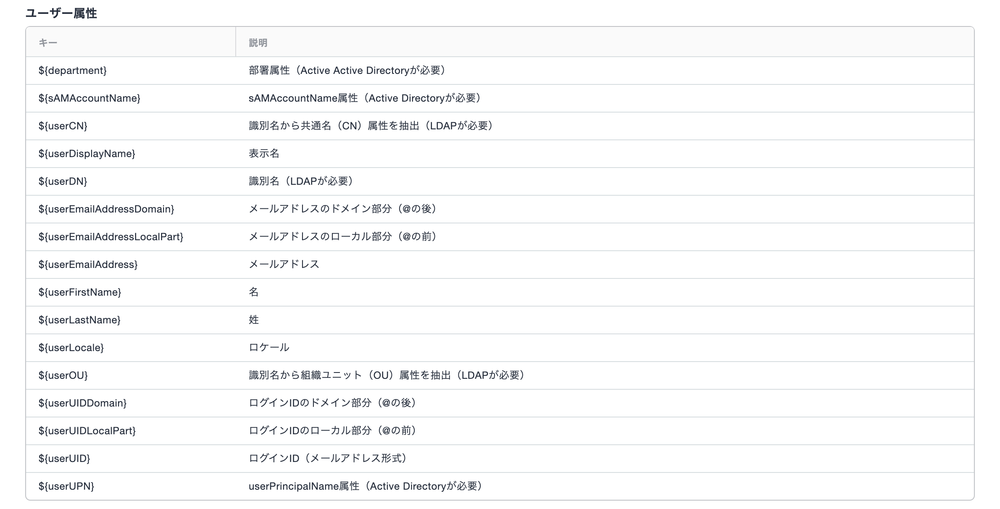
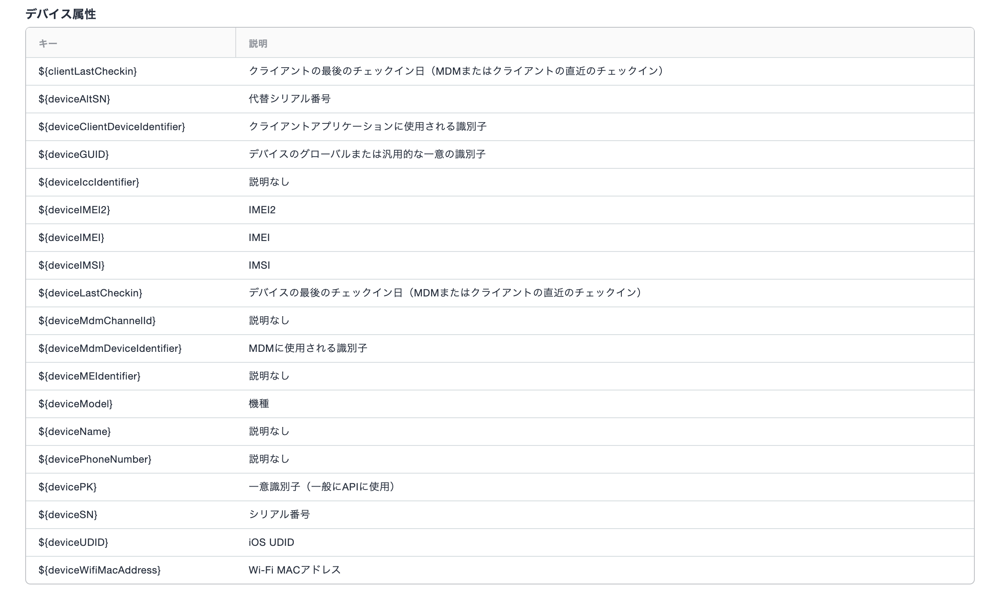
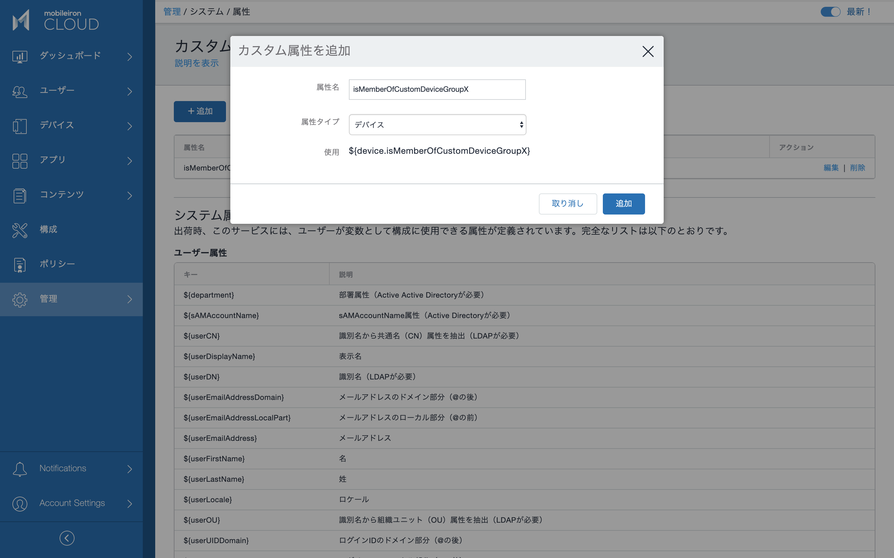
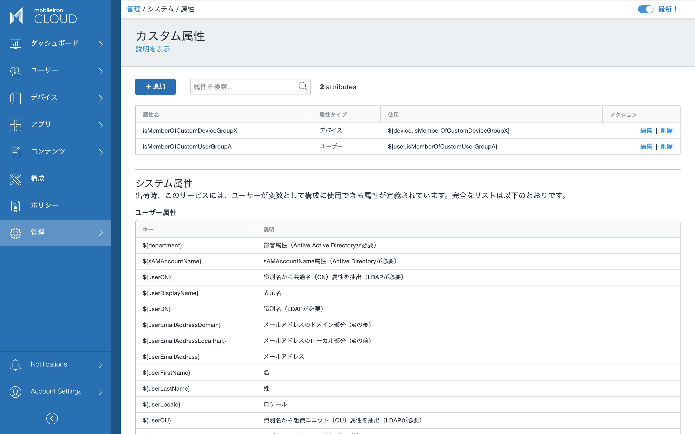

# 属性

ユーザーの名前やEメールアドレス、デバイスのシリアル番号など、ユーザーやデバイスに固有の情報は「属性」として管理されます。これを上手く利用することで効率的な管理が可能になります。前項で作成したローカルユーザーが持つ属性とその値を見てみましょう。

ユーザー > （ユーザーを選択）> 属性タブ

例えばこのユーザーのユーザーIDを表す属性名は ${userUID} で、その値は taro@mobilefirst.jp です。

利用可能なすべての属性の種類はシステムメニューから確認することができます。

管理 > システム > 属性

多くの属性がシステム属性として予め定義されています。ユーザーのためのシステム属性には次のようなものがあります。Active Directoryなどの外部ディレクトリから同期したユーザーでは、外部ディレクトリ上のユーザー属性も取り込むことができます。

ユーザーだけでなくデバイスにも多くの属性が定義されています。デバイスをMobileIron Cloudに登録することで収集されたハードウェアの情報は、ぞれぞれを表す属性の値として格納されます。

## カスタム属性

予め定義されているシステム属性以外に、任意のユーザー属性やデバイス属性を、カスタム属性として定義することができます。カスタム属性には管理者が自由に値をセットすることができます。

次項以降で説明する、属性値の条件を使ったグルーピングに利用することを想定して、カスタム属性を定義してみましょう。

+追加ボタンをクリックします。

isMemberOfCustomUserGroupA という名前のカスタムユーザー属性を定義します。

同様に isMemberOfCustomDeviceGroupX というカスタムデバイス属性を定義します。属性タイプとして今度はデバイスを指定します。

カスタム属性の定義はこれだけで完了です。実際には個々のユーザーやデバイスに対して、これらのカスタム属性とその値をセットして利用します。次項で詳しく説明します。
