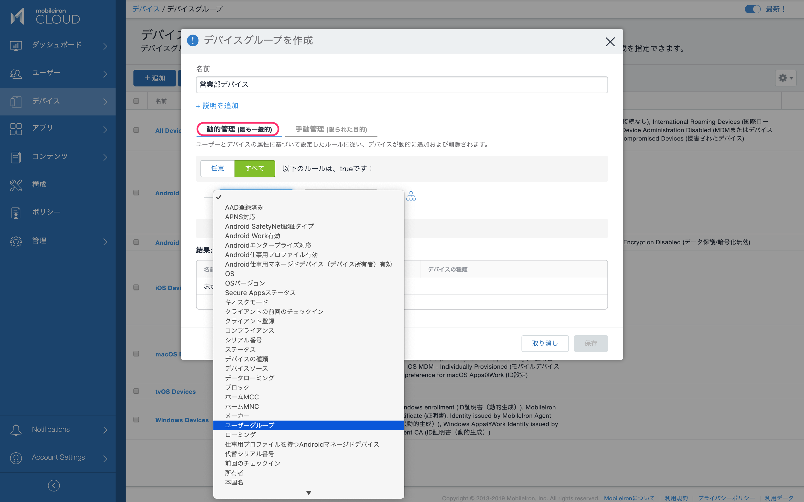
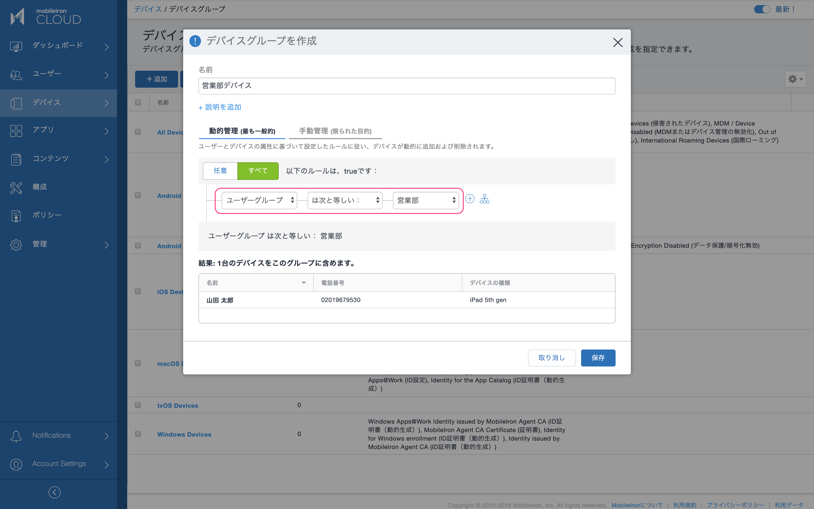
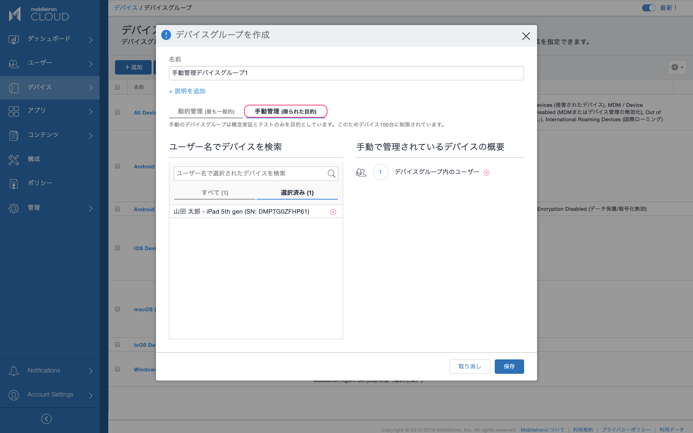
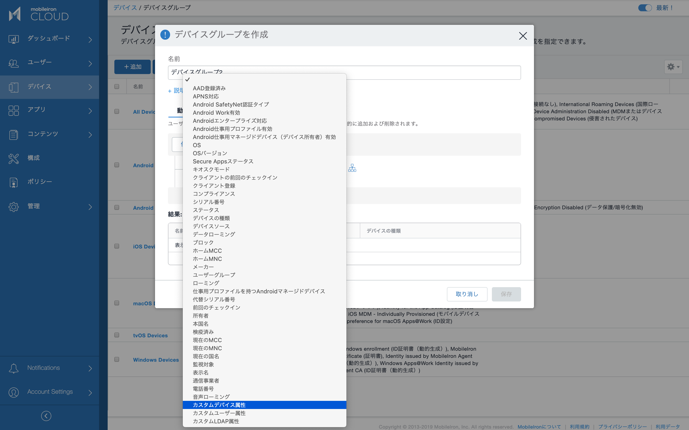
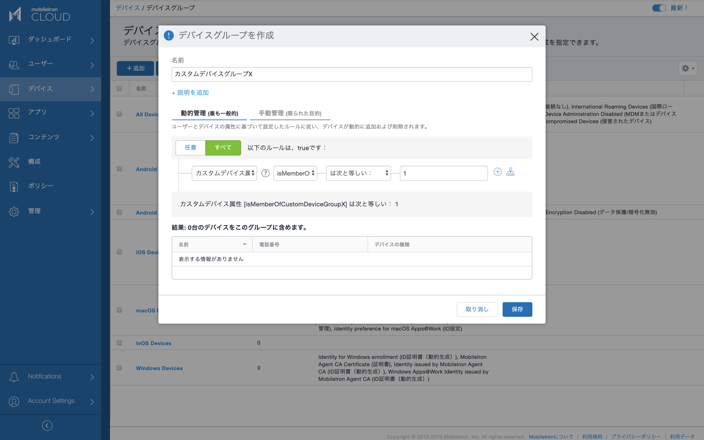
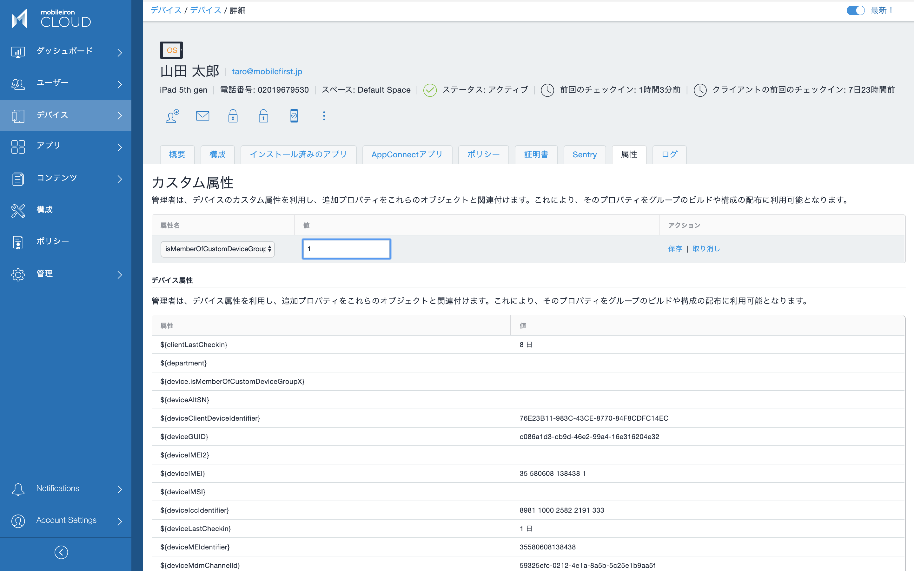

# デバイスグループ

それぞれのデバイスは１つ以上のデバイスグループに所属することができます。デバイスグループには次のようなものがあります。
- デバイスのOS別に用意されたデフォルトのデバイスグループ
- 特定のユーザーグループのメンバーが所持するデバイスのグループ
- 属性値を条件にした動的管理のデバイスグループ
- 手動管理のデバイスグループ

## デバイスのOS別に用意されたデフォルトのデバイスグループ

以下のデバイスグループは予め用意されており、該当するOSのデバイスが自動的に所属します。
- Android Devices
- Android Enterprise Devices
- iOS Devices
- macOS Devices
- tvOS Devices
- Windows Devices

## 特定のユーザーグループのメンバーが所持するデバイスのグループ

動的管理ユーザーグループの定義としてよく利用されるのが、特定のユーザーグループのメンバーが所持するデバイスのグループです。グループ定義のフィルタ条件となっているユーザーのデバイスが登録されると、自動的にそのデバイスグループに所属します。

デバイス > デバイスグループ > +追加

動的管理タブを選択し、ユーザーグループが一致することを条件とするルールを定義します。

## 手動管理デバイスグループ

手動管理のデバイスグループは素早く直感的に作成できます。

デバイス > デバイスグループ > +追加

手動管理タブを選択し、MobileIron Cloudに登録済みのデバイスの中から、グループに含めたいデバイスを選択します。

注意：手動管理デバイスグループは簡単に作成できる一方で、数多くのデバイスを含めることには適していません。手動管理デバイスグループのGUIで全デバイスが容易に確認できる程度の数で利用するようにして下さい。

## 属性値を条件にした動的管理のデバイスグループ

動的管理デバイスグループは、デバイスが持つ様々な属性情報やステータスを条件として定義することができます。前に作成したカスタムデバイス属性を用いてルールを定義してみます。

デバイス > デバイスグループ > +追加

動的管理タブを選択し、カスタムデバイス属性とその値を条件とするルールを定義します。

先に作成した isMemberOfCustomGroupX 属性を使います。

後でデバイスにカスタム属性の値を設定することでデバイスグループに含められます。

デバイス > デバイス >（名前を選択して詳細表示）> 属性タブ

