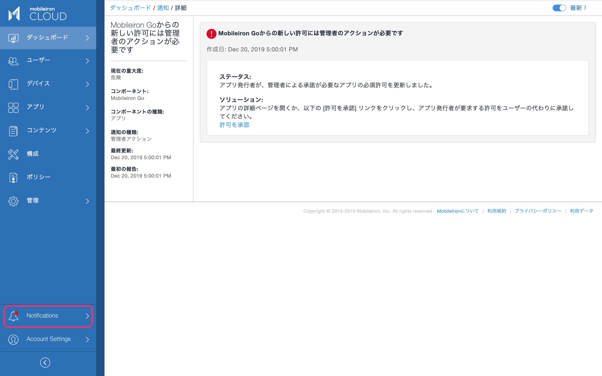
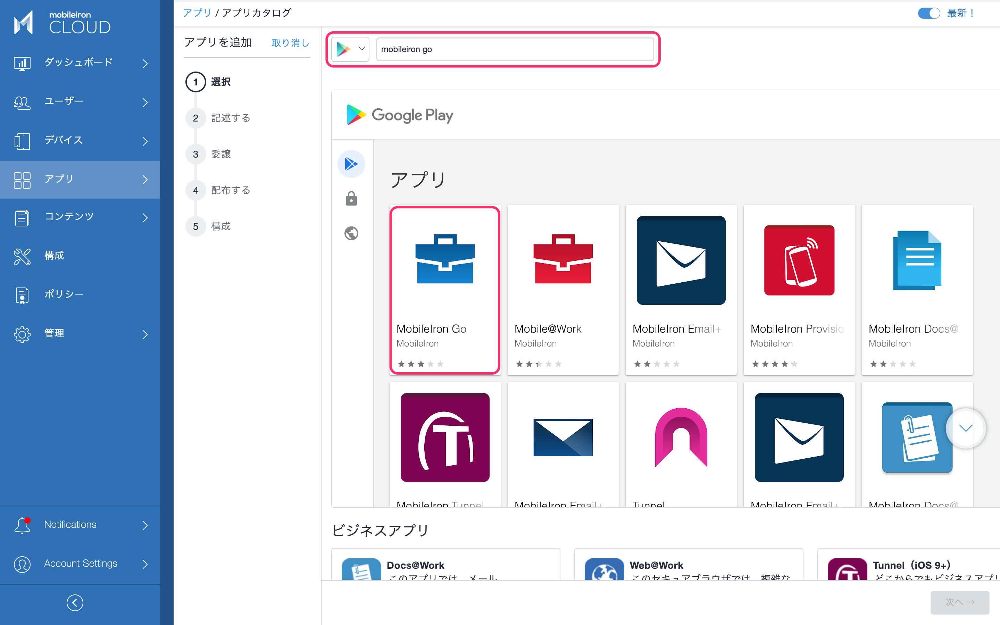
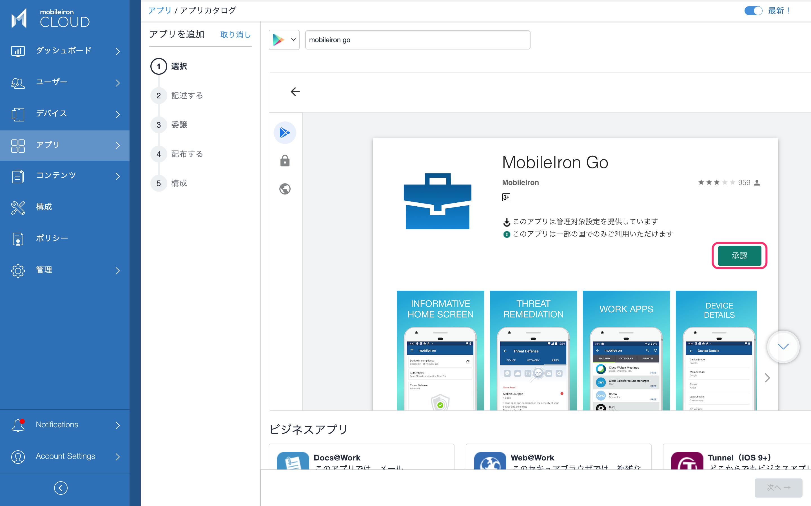
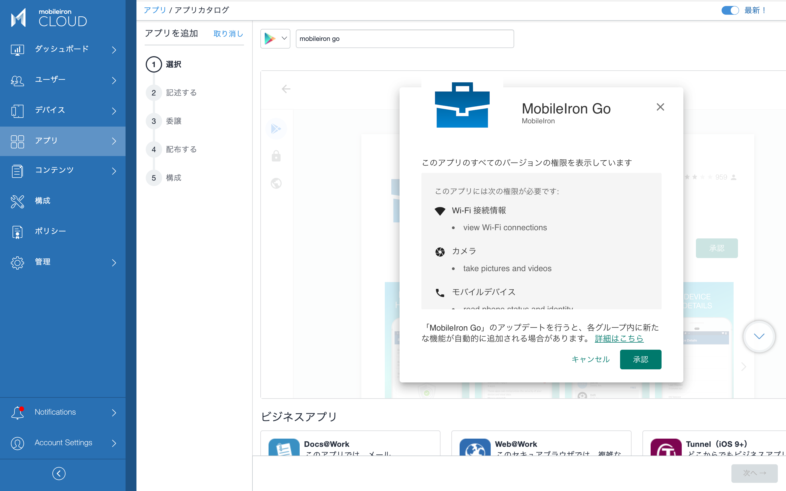
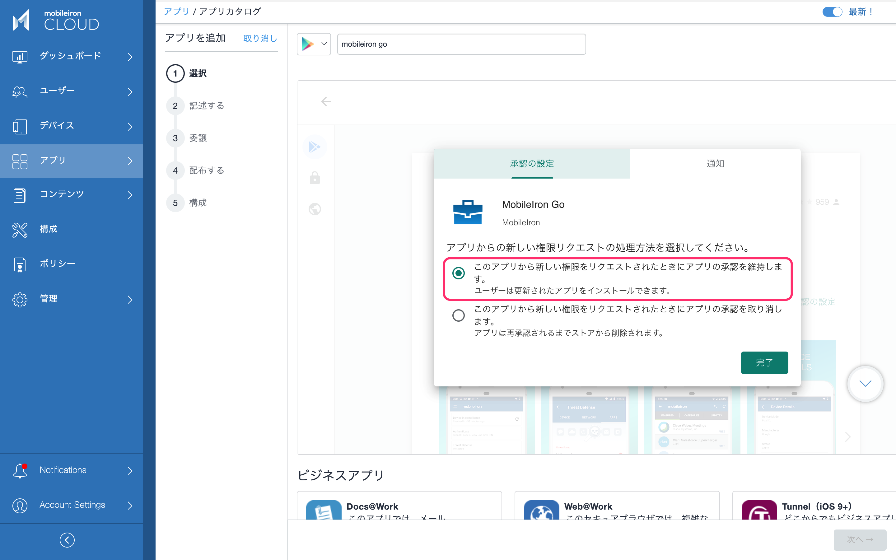
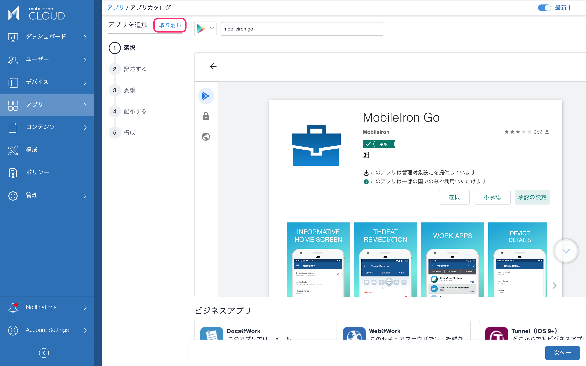
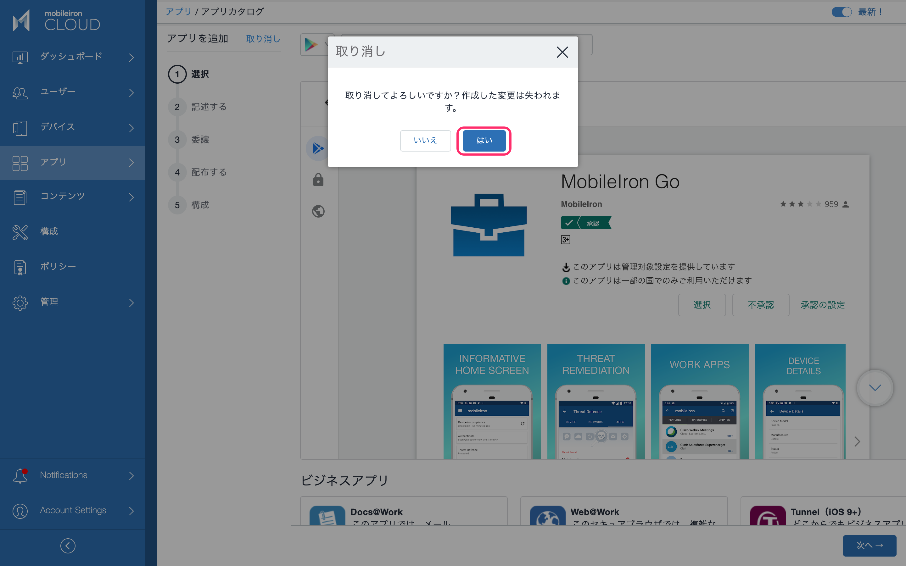

# MobileIron Goアプリの権限承認設定

Android Enterpriseを有効に設定して以来、次のような通知が出るようになったことに気づかれたかもしれません。

MobileIron GoアプリはデフォルトではApp Catalogに表示されていませんが、暗黙的にManaged Google Playにインポートされており、管理者による権限の承認が必要なため、このような通知が表示されます。この画面から「許可を承認」としても良いのですが、今後も同様の作業を行う必要を無くすために、新しい権限が自動的に承認されるように変更します。

アプリ > アプリカタログ > Google Playを選択し、MobileIron Goを検索

承認ボタンをクリック。

承認ボタンをクリック。

「このアプリから新しい権限をリクエストされたときにアプリの承認を維持します」を選択。完了をクリック。

この時点でManaged Google PlayにはMobileIron Goアプリの権限承認設定が反映されています。

ここで「次へ」をクリックするとApp CatalogにMobileIron Goが表示されるようになりますが、その必要は無いので「取り消し」をクリックします。

以上で完了です。
