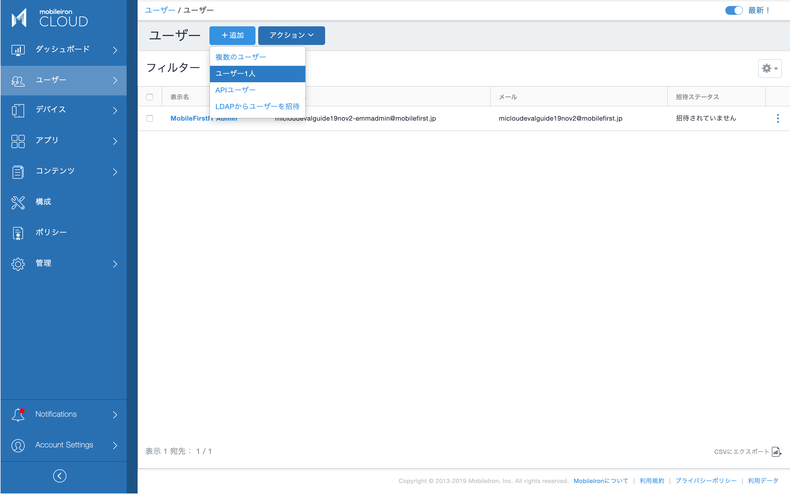
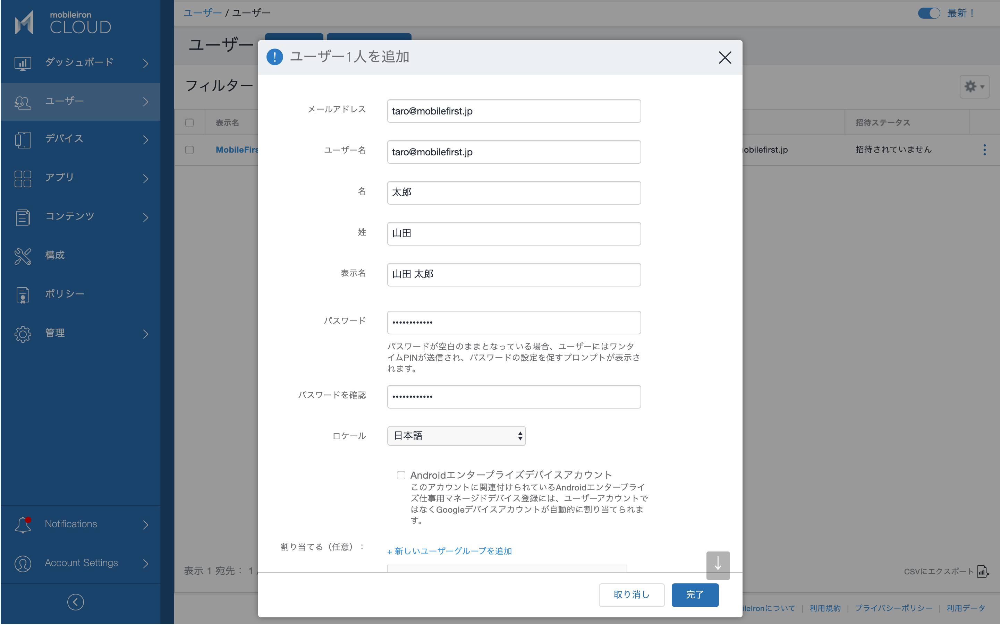
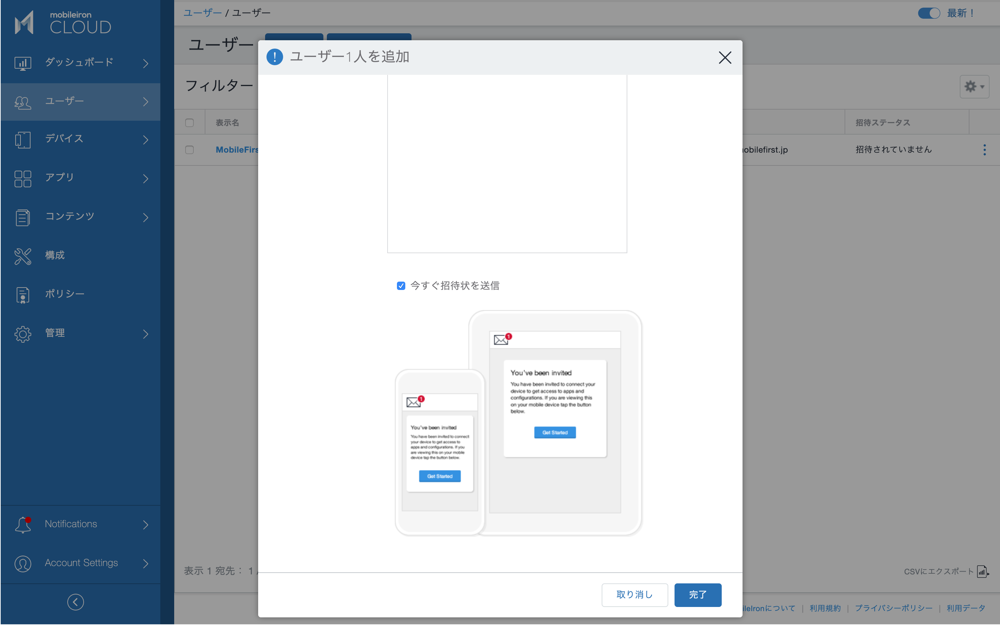
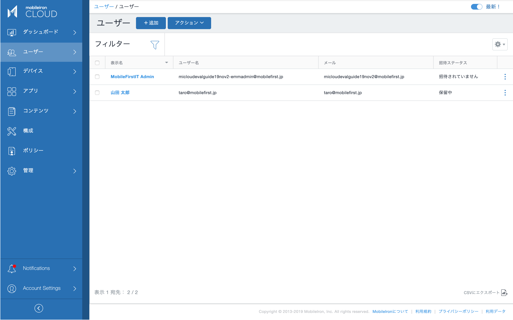
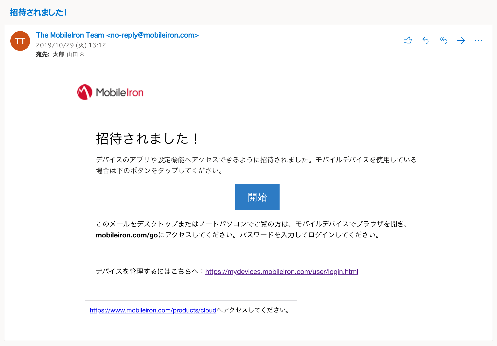

# ローカルユーザーを作成する

MobileIron Cloudでは、デバイスの登録は必ずユーザーと紐付けて行います。ユーザーは、ローカルユーザーとして作成するか、以下の種類の外部ディレクトリと同期して読み込むことができます。
- Active Directory または LDAPサーバ
- Azure Active Directory

本ガイドではローカルユーザーを作成して利用します。

ユーザー > +追加 > ユーザー1人

複数のユーザーをまとめて作成、またはCSVで読み込むこともできますが、ここでは1人ずつ作成します。

- MobileIron Cloudのユーザー名はEメールアドレスの形式である必要があります（Eメールアドレスと同じである必要はありません）。また全てのリージョンの全てのMobileIron Cloudテナントでユニークである必要があります。
- Eメールアドレスも必須ですが、ユニークである必要は無く、同じテナント内の複数のユーザーが同じEメールアドレスでも構いません。

設定例：

ユーザーの作成画面からユーザーグループの作成や割り当てを行うこともできますが、本ガイドではユーザーグループについて次項で別途設定します。

「今すぐ招待状を送信」にチェックを入れると、作成したユーザーにデバイス登録を促すEメールが送信されます。招待状を送信しなくてもデバイスは登録できます。

ローカルユーザーが作成されました。

招待状を送信した場合、ユーザーには以下のようなEメールが届きます。

