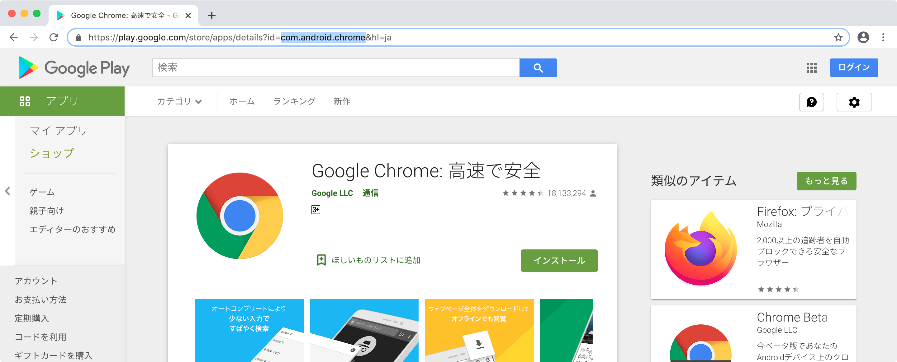
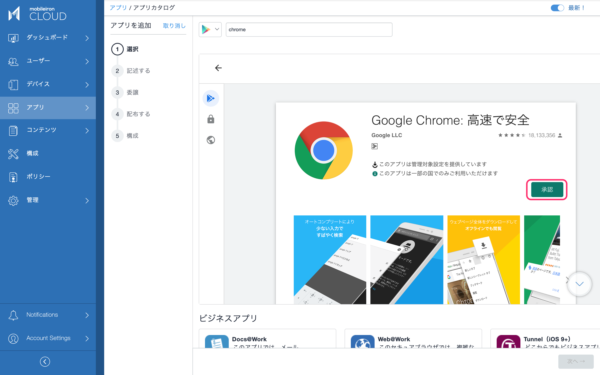

# Managed Google Playでアプリを配布する

Android Enterpriseにおいて仕事領域へのアプリの配布にはManaged Google Playを利用します。Managed Google Playは、通常個人で利用するGoogle Playとは別に、お客様組織専用に用意されたGoogle Playで、企業で利用したいパブリックアプリとインハウスアプリを登録して配布することができます。
なおMobileIron CloudにおいてはManaged Google Playの管理画面を直接利用することはありません。全ての操作はMobileIron Cloudの管理コンソール上からできるようになっています。

Chromeを仕事領域に配布してみましょう。Chromeは個人領域に既にインストールされていますが、Android Enterpriseでは仕事領域にもChromeをインストールし、個人領域のChromeとは別のアプリ（アイコン）として利用することができます。

アプリ > アプリカタログ > +追加 > Google Playを選択し、Chromeを検索

> ヒント：もしこの画面の検索でうまく目的のアプリが見つけられない場合、アプリの名前ではなくIDを使って検索すると確実です。アプリのIDはGoogle PlayのWebサイトで目的のアプリを検索し、そのページのURLから確認できます。
> 

目的のアプリを選択し、承認ボタンをクリック。

アプリが要求する権限を確認し、承認をクリック。

アプリが将来のバージョンで新しい権限を要求するようになった場合の取り扱いを決めておきます。信頼できる開発元であれば承認を維持して問題ないでしょう。完了をクリック。

次へをクリック。

必要に応じてApp Catalog上でのカテゴリを設定します。デフォルトではGoogle Playで設定されているカテゴリが適用されます。

次へをクリック。

このアプリの配布対象とするユーザーを選択します。特定のユーザーグループにのみ配布したい場合には「カスタム」を選択し、対象ユーザーグループを指定します。次へをクリック。

## アプリの設定

アプリによってはMobileIron Cloudから設定を配布できるものがあります。Google Chromeもその一つです。

Android用マネージド構成を[ + ]ボタンで追加します。

アプリの開発者が設定項目を用意している場合、マネージド構成の設定フォームが表示されます。

ブックマークを追加してみましょう。

Google ChromeのブックマークはJSON形式で記述します。階層構造を持たせることもできます。またMobileIron Cloudのユーザー属性やデバイス属性を利用することもできます。例：

`[ { "name": "MobileIron", "url": "https://www.mobileiron.com/" }, { "name": "マイデバイス", "url": "https://ap1.mobileiron.com/user/login.html?uid=${userUID}" }, { "name": "社内", "children": [ { "name": "サイト1", "url": "http://site1.yourdomain.com" }, { "name": "サイト2", "url": "http://site2.yourdomain.com" } ] } ]`

一番下までスクロールすると、アプリ設定の配布対象ユーザーを指定することができます。アプリを利用する全員、またはカスタムでユーザーグループを選択し、次へ。

## 自動インストール

アプリのインストールは、デフォルトの設定ではユーザーが仕事用のGoogle Playからインストール操作を行う必要がありますが、自動インストールに設定しておくこともできます。

「デバイスにインストール」の設定を開きます。デフォルトで１つの設定が作成されています。

デフォルトでは「デバイスにインストール」がOFFになっています。Chromeを自動でインストールさせたい場合、ONに変更して次へをクリック。

完了をクリック。

以上でGoogle ChromeアプリをMobileIron CloudのApp Catalogにインポートし、Android Enterpriseデバイスが登録された際には自動的にManaged Google Playを通じて仕事領域にインストールする設定が完了しました。またマネージド構成として配布したブックマークもChromeアプリで利用できるようになります。
