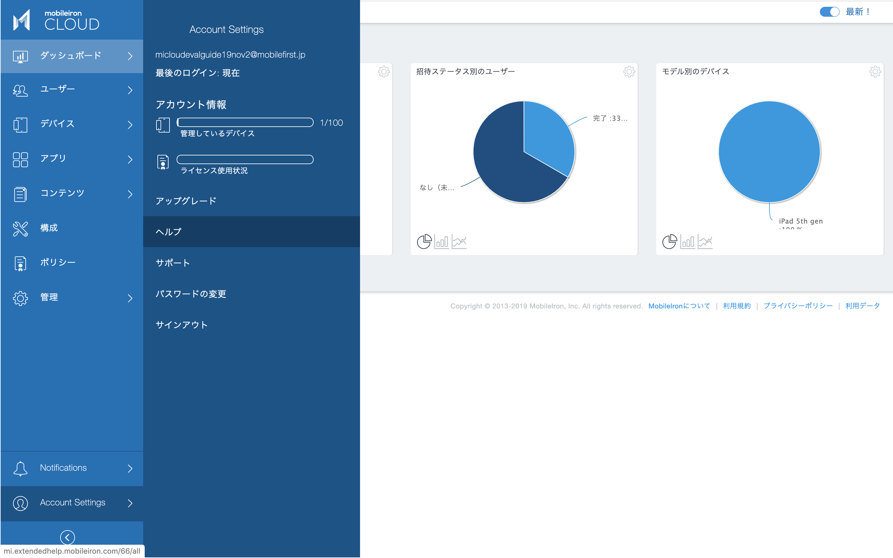
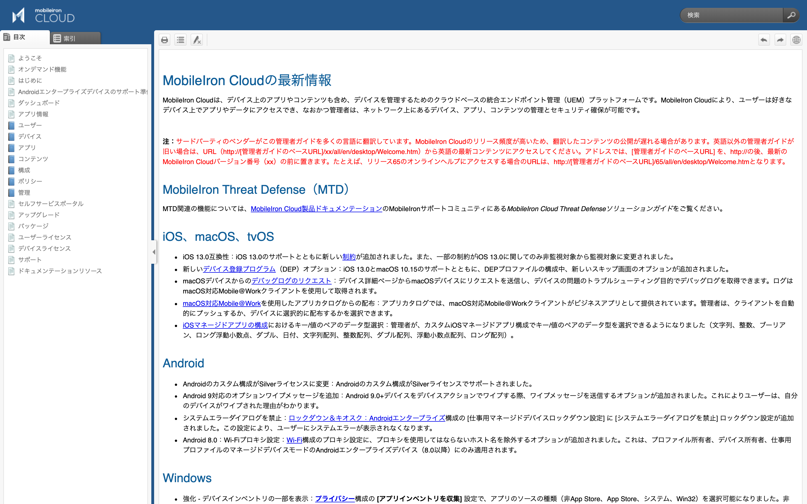

# オンラインヘルプ

MobileIron Cloudのオンラインヘルプは管理画面からのリンクで参照することができます。

Account Settings > ヘルプ

日本語のオンラインヘルプが提供されています。

### 英語で表示される場合

言語設定が日本語のブラウザでオンラインヘルプを開いても、英語版が表示される場合があります。

MobileIron Cloudの最新リリースのヘルプが日本語に未翻訳の場合、英語版のヘルプが表示されます。この場合、１つ前のリリースの日本語版ヘルプのURLを指定してみて下さい。オンラインヘルプのURLは以下のようになっています。

http://mi.extendedhelp.mobileiron.com/XX/all/ja/Welcome.htm

URLのXXがリリース番号です。例えばリリース66の日本語版が提供されていない場合、ここを65に書き換えます。
