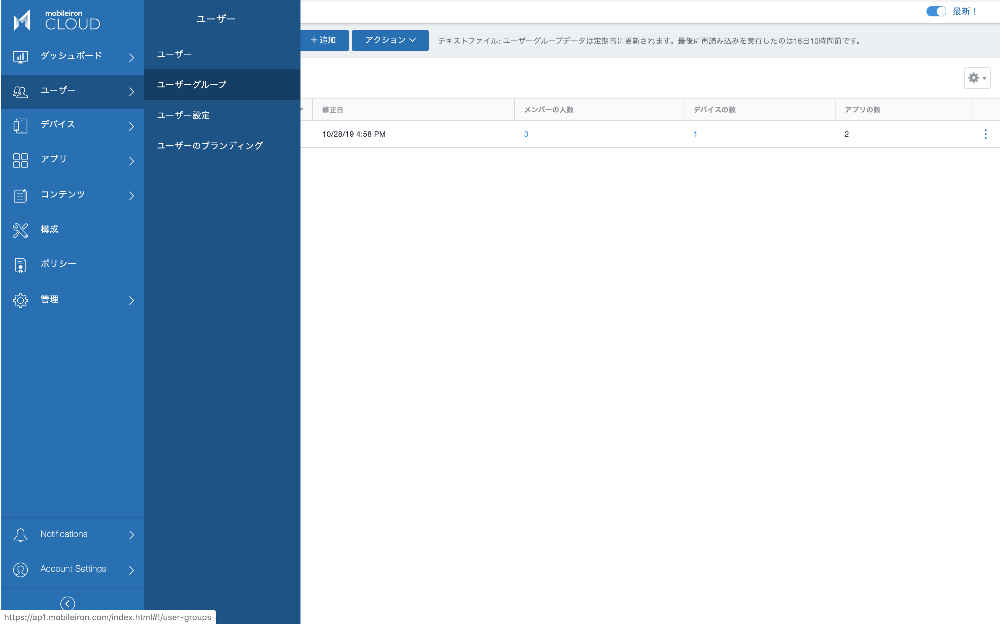
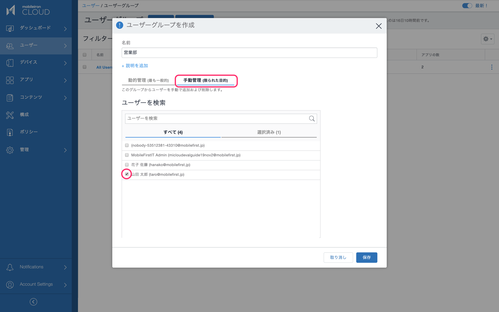
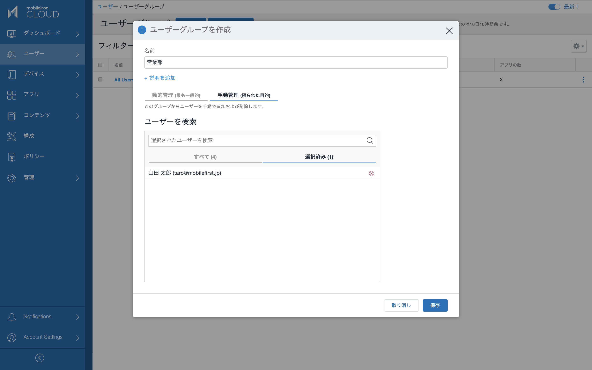
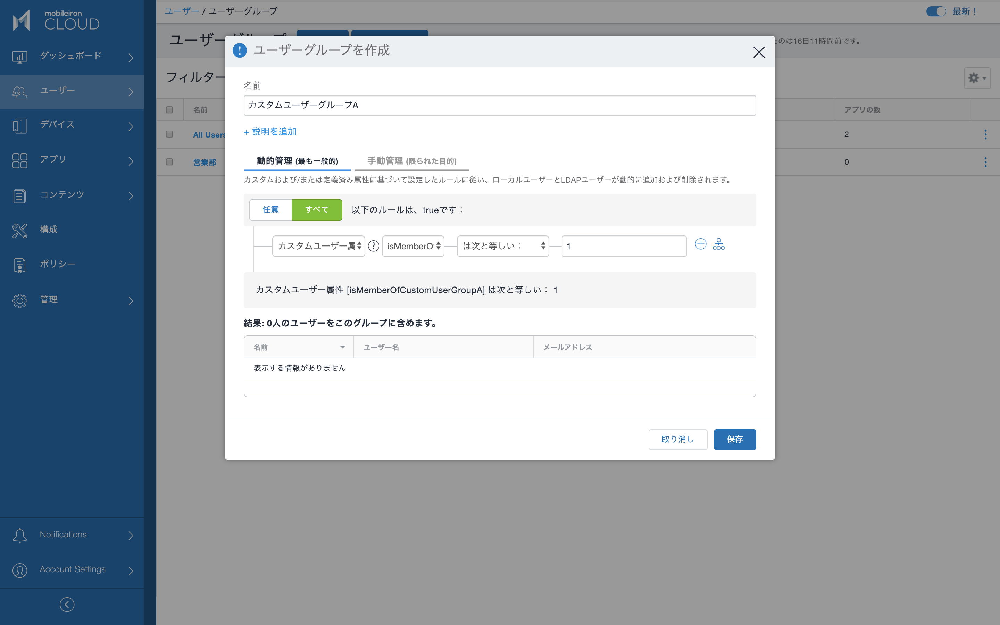
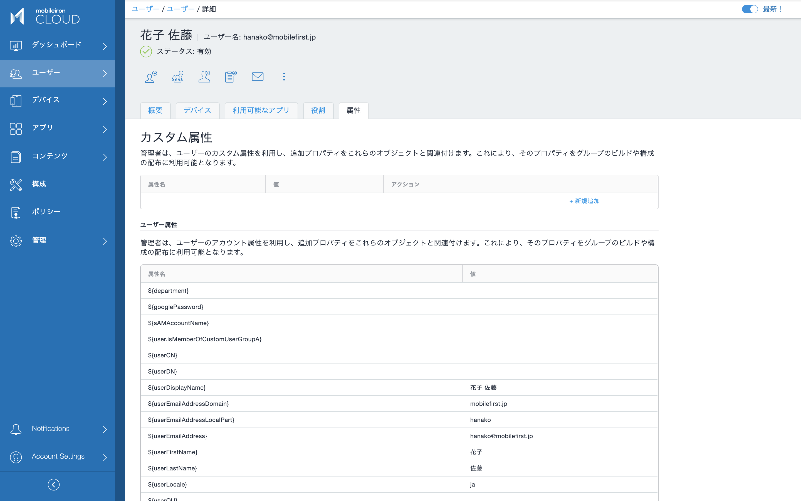
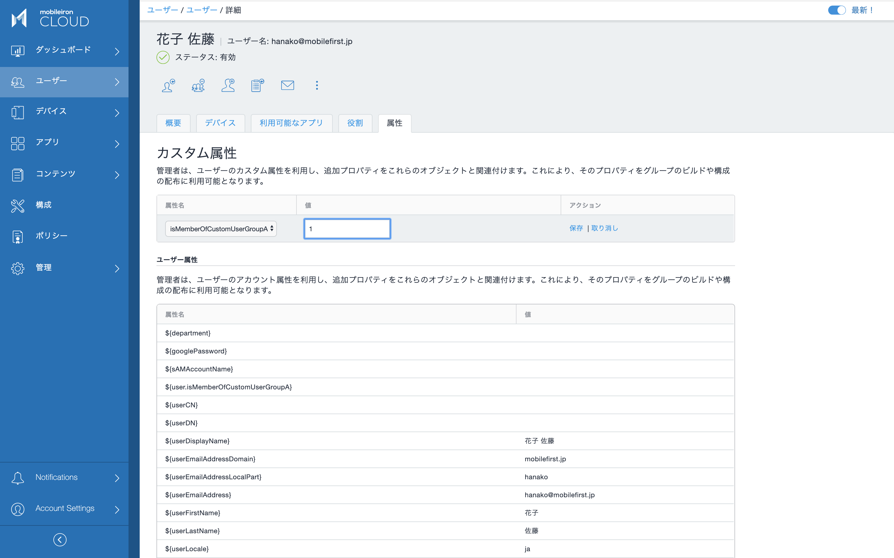
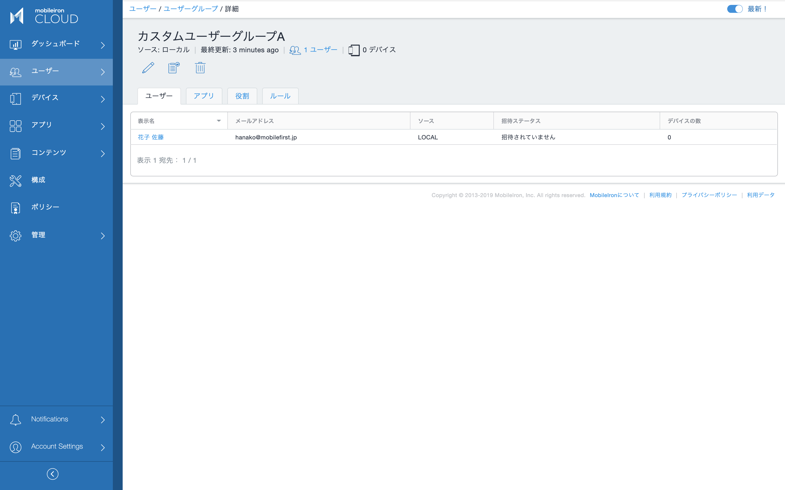
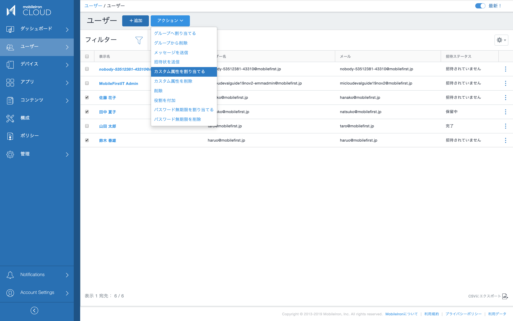
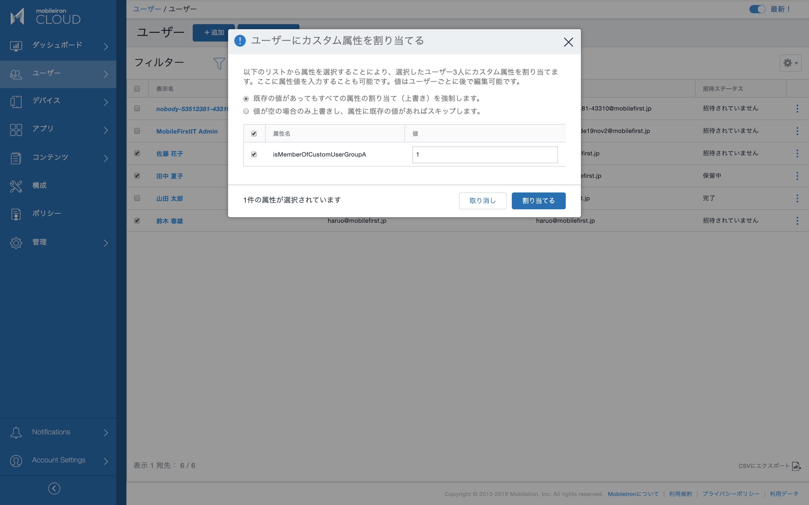
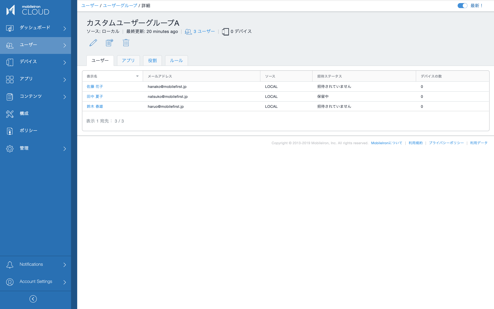

# ユーザーグループ

それぞれのユーザーは１つ以上のユーザーグループに所属することができます。ユーザーグループには次のようなものがあります。
- 手動管理のユーザーグループ
- 外部ディレクトリと連携するユーザーグループ（AD/LDAP上のOUやグループを同期したもの）
- 属性値を条件にした動的管理のユーザーグループ

## 手動管理ユーザーグループ

手動管理のユーザーグループは素早く直感的に作成できます。

ユーザー > ユーザーグループ > +追加

手動管理タブを選択し、ユーザーを検索して追加（チェック）します。

ユーザーグループのメンバーは選択済みタブに表示されます。

注意：手動管理ユーザーグループは簡単に作成できる一方で、数多くのメンバーを管理することには適していません。手動管理ユーザーグループは上の編集画面で全メンバーが容易に確認できる程度の数で利用するようにして下さい。

## 外部ディレクトリと連携するユーザーグループ

外部ディレクトリからグループやOUをMobileIronに同期した場合、そこに含まれるユーザーと共に、グループやOUもMobileIron Cloud上のユーザーグループとして自動的に認識します。本ガイドでは割愛します。

## 属性値を条件にした動的管理のユーザーグループ

動的管理のユーザーグループは大規模な運用に適しています。本番運用において、外部ディレクトリと連携するもの以外のユーザーグループは、手動管理ではなくこちらの属性値を条件にした動的管理のユーザーグループとして定義しておくことをお勧めします。

ユーザー > ユーザーグループ > +追加

動的管理のユーザグループは１つまたは複数の条件をANDまたはORでつないだルールによって定義します。先に作成したカスタム属性を条件に使ってユーザーグループを定義してみましょう。
- カスタムユーザー属性 [isMemberOfCustomUserGroupA] は次と等しい： 1

まだこのユーザーグループ含まれるメンバーはいません。ユーザーに属性値 isMemberOfCustomUserGroupA=1 を与えることで、そのユーザーがメンバーになります。

ユーザー > ユーザー >（ユーザーの表示名を選択して詳細表示）> 属性タブ

カスタム属性を +新規追加 します。

属性名 isMemberOfCustomUserGroupA を選択し、値に 1 をセットして保存します。

動的ユーザーグループのメンバーを確認します。

ユーザー > ユーザーグループ >（ユーザーグループの名前を選択して詳細表示）> ユーザータブ

属性値をセットしたユーザーがユーザーグループのメンバーになりました。

ユーザーの一覧から複数ユーザーを選択し、カスタム属性をまとめて割り当て（または削除）することもできます。

